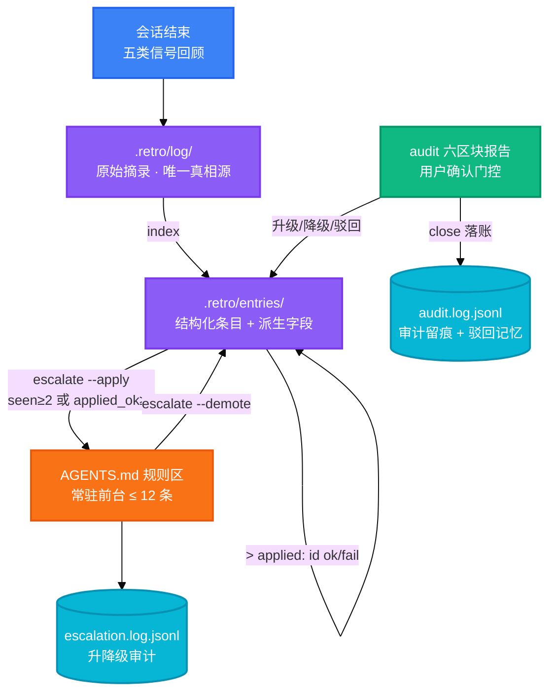

<h1 align="center">retro</h1>

<p align="center">
  <strong>把 Agent 会话经验编译成持久知识，再蒸馏为可复用的规则</strong>
  <br />
  <em>经验沉淀 · 验证门控 · 定期审计 · 规则升降级</em>
</p>

<p align="center">
  <a href="#quick-start"></a>
  <a href="#contributing"></a>
</p>

<p align="center">
  
  
  <a href="https://docs.anthropic.com/en/docs/claude-code"></a>
  <a href="https://cursor.sh"></a>
</p>

---

## Features

| Feature | Description |
|---|---|
| 经验沉淀 | 会话收尾时回顾本会话，把可复用的坑与策略写入项目 `.retro/` 知识库；只追加不删除，log 是唯一真相源 |
| 验证门控 | 经验升级到 `AGENTS.md` 常驻规则区需要证据：被重复踩过（seen_count≥2）或被实际应用且有效（applied_ok≥1） |
| 双层记忆 | `.retro/` 是按需查阅的档案库（不限量），`AGENTS.md` 是每个会话都加载的常驻前台（上限 12 条），升降级双向流动 |
| 确定性记账 | 计数、去重、升降级、审计日志全部由脚本完成，零 LLM 参与——LLM 只负责判断与内容 |
| 审计轮 | `audit` 子命令输出六区块只读报告：健康检查 / 升级候选 / 降级候选 / 失效候选 / 重复合并 / 审计状态 |
| 驳回记忆 | 审计中被驳回的候选 7 天内静默，之后自动重新浮出并标注「请复查」，不重复打扰也不永久遗漏 |

## Quick Start

### Prerequisites

- Python 3.10+
- 一个使用 agent（Claude Code / Cursor 等）开发的项目

### Install

把本仓库的 `SKILL.md` 与 `scripts/retro.py` 复制到你的 agent 技能目录：

```bash
git clone https://github.com/EwenYoung/retro.git
mkdir -p ~/.agents/skills
cp -r retro ~/.agents/skills/
```

### Set Up

在目标项目的 `AGENTS.md` 中加入经验规则标记区：

```markdown
## 经验教训

<!-- retro-managed-start -->
<!-- retro-managed-end -->
```

### Run

让 agent 复盘当前会话（说「沉淀一下」「记一下这次的坑」或「retro」），随后校验：

```bash
retro.py --root <项目目录> check
```

## Usage

### 沉淀会话经验

会话收尾时触发（也可由 agent 在完成硬仗后主动触发），agent 回顾会话找五类信号——失败的尝试、用户的纠正、找了很久才发现的信息、被推翻的假设、稳定奏效的策略——按收录门槛（可复用 / 非显而易见 / 跨会话有效）写入：

```bash
# agent 写入后由脚本补齐派生字段
retro.py --root <项目目录> index
retro.py --root <项目目录> check   # 0 error 为验收线
```

### 升级经验为常驻规则

```bash
retro.py --root <项目目录> escalate               # 干跑：列候选与逐项理由
retro.py --root <项目目录> escalate --apply <id>   # 用户确认后升级到 AGENTS.md
```

升级门槛：`status=verified` 且（`seen_count≥2` 或 `applied_ok≥1`）且未被 superseded。评分 = `seen_count×2 + applied_ok×2` + 全局 tag 加成 + 简短加成。

### 记录经验的应用结果

新会话实际采用了某条经验时，agent 在 log 段落追加一行引用（ok = 有效，fail = 没解决）：

```markdown
> applied: 20260824-001 ok
```

applied 数据是升级门槛的第二条证据通道，也是审计轮判断经验是否过时的依据。

### 定期审计

```bash
retro.py --root <项目目录> audit    # 六区块只读报告，不写任何状态
```

距上次审计 ≥7 天、期间新增 ≥10 条、或规则区 ≥10/12 时建议跑一轮。LLM 语义复核报告中的降级/失效/重复候选，决策清单经用户确认后走 `escalate --apply/--demote` 执行，最后 `audit --close "总结" --dismissed <id,...>` 落账。

## Architecture



- **向下流动（沉淀）**：会话 → log → entries → AGENTS.md，每一步有门槛
- **向上流动（反馈）**：`applied ok/fail` 引用行记录经验的真实应用效果，驱动下一轮升级/失效判断
- **回环（审计）**：audit 定期把全库拉出来体检，验证过的经验升级、过时的降级、驳回的有记忆

## Project Structure

```
retro/
├── SKILL.md                   # 技能指令：回顾信号、收录门槛、审计轮流程
├── scripts/
│   └── retro.py               # 确定性脚本：index / check / stats / escalate / reconcile / audit
├── tests/
│   └── test_retro.py          # 24 个集成测试
├── .gitignore
└── .gitattributes
```

数据落在目标项目（不落在本仓库）：

```
<项目>/
├── AGENTS.md                  # 经验规则区（retro-managed 标记区，≤12 条）
└── .retro/
    ├── log/YYYY-MM-DD.md      # 会话原始摘录（只追加）
    ├── entries/YYYYMMDD-NNN.md  # 结构化条目（YAML frontmatter + 正文）
    ├── INDEX.md               # 脚本生成的索引
    ├── escalation.log.jsonl   # 升降级审计日志
    └── audit.log.jsonl        # 审计轮次记录
```

## Tech Stack

| Layer | Technology | Purpose |
|---|---|---|
| Language | Python 3 | 单文件确定性脚本，严格 YAML 子集解析，零第三方依赖 |
| Testing | Pytest | 24 个集成测试：派生字段、门槛评分、审计区块、只读纪律（文件 hash 比对）、GBK stdout 回归 |
| Host | Claude Code / Cursor | 技能由 agent 加载执行，SKILL.md 是全部行为规范 |

## Contributing

1. Fork 仓库
2. 建分支（`git checkout -b feature/x`）
3. 提交（中文 conventional commits：`feat:` / `fix:` / `docs:`）
4. 跑 `uv run pytest tests/ -q` 确认全绿
5. 发 Pull Request

## License

暂未添加 LICENSE 文件。Add a LICENSE to clarify project licensing.
