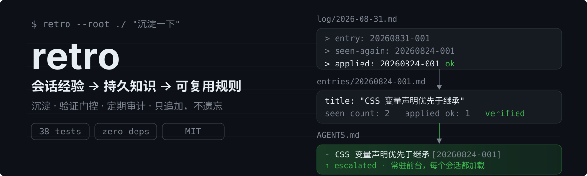
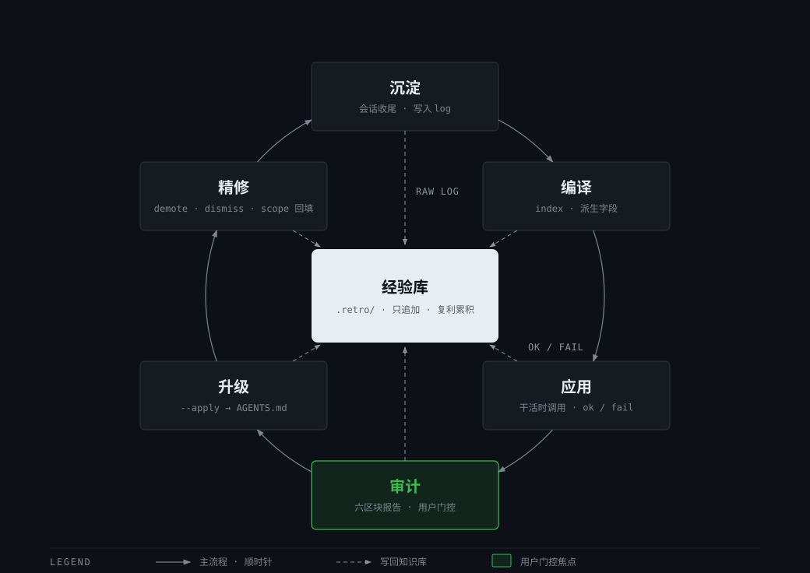

<div align="right">

**中文** · [English](README-zh.md)

</div>

<p align="center">
  
</p>

---

## 功能特性

| Feature | Description |
|---|---|
| 经验沉淀 | 会话收尾时回顾本会话，把可复用的坑与策略写入项目 `.retro/` 知识库；只追加不删除，log 是唯一真相源 |
| 验证门控 | 经验升级到 `AGENTS.md` 常驻规则区需要证据：被重复踩过（seen_count≥2）或被实际应用且有效（applied_ok≥1） |
| 双层记忆 | `.retro/` 是按需查阅的档案库（不限量），`AGENTS.md` 是每个会话都加载的常驻前台（上限 12 条），升降级双向流动 |
| 确定性记账 | 计数、去重、升降级、审计日志全部由脚本完成，零 LLM 参与——LLM 只负责判断与内容 |
| 审计轮 | `audit` 子命令输出六区块只读报告：健康检查 / 升级候选 / 降级候选 / 失效候选 / 重复合并 / 审计状态 |
| 驳回记忆 | 审计中被驳回的候选 7 天内静默，之后自动重新浮出并标注「请复查」，不重复打扰也不永久遗漏 |

## 快速开始

```bash
git clone https://github.com/EwenYoung/retro.git ~/.agents/skills/retro
```

装好即用——之后所有事都由 agent 自动完成，无需配置。

## 使用方法

也可以说「复盘」「总结经验」「记一下这次的坑」，或者什么都不说——agent 完成一场硬仗（修了个棘手 bug、搭好环境、长调试收尾）后会主动建议沉淀；没什么可记时它会直接说「本次没有值得沉淀的经验」，不硬凑。

### agent 背后的工作流程

「沉淀一下」触发后，agent 依次执行：

1. **回顾本会话**，找五类信号：失败的尝试、用户的纠正、找了很久才发现的信息、被推翻的假设、稳定奏效的策略
2. **按收录门槛过滤**：可复用、非显而易见、跨会话有效，三条同时满足才收录——从旧条目读来的内容不算新经验（防统计污染）
3. **写入 `.retro/log/`**（原始摘录，只追加）与 `.retro/entries/`（结构化条目），同坑再现记 `seen-again`；会话中实际沿用了某条旧经验时，agent 自行判断是否管用并记 `applied: ok/fail`——经验是在干活时自动调用的，不需要用户提醒
4. **跑脚本记账**：`retro.py index` 补派生字段，`retro.py check` 校验（0 error 为验收线）
5. **升级决策**：`retro.py escalate` 列出候选与逐项理由，经你确认后 `--apply` 升级进 `AGENTS.md` 规则区（上限 12 条，满了先降级最旧的）

升级门槛是硬性的：条目必须 `verified` 且（被踩过 ≥2 次或被应用且有效 ≥1 次），没有证据的经验留在档案库。

### 定期审计

距上次审计 ≥7 天、期间新增 ≥10 条、或规则区 ≥10/12 时，agent 会在收尾时建议跑一轮审计。执行 `retro.py audit` 得到六区块只读报告，agent 逐条语义复核后给你决策清单——升、降、合并、驳回，你确认后才执行，最后 `audit --close` 落账。被驳回的候选 7 天内静默，之后自动重新浮出并标注「请复查」。

## 架构

<p align="center">
  
</p>

- **向下流动（沉淀）**：会话 → log → entries → AGENTS.md，每一步有门槛
- **向上流动（反馈）**：`applied ok/fail` 引用行记录经验的真实应用效果，驱动下一轮升级/失效判断
- **回环（审计）**：audit 定期把全库拉出来体检，验证过的经验升级、过时的降级、驳回的有记忆

## 项目结构

```
retro/
├── SKILL.md                   # 技能指令：回顾信号、收录门槛、审计轮流程
├── scripts/
│   └── retro.py               # 确定性脚本：index / check / stats / escalate / reconcile / audit
├── tests/
│   └── test_retro.py          # 24 个集成测试
├── assets/readme/             # README 视觉素材（SVG 源文件）
├── LICENSE
└── README.md
```

数据落在目标项目（不落在本仓库）：

```
<项目>/
├── AGENTS.md                  # 经验规则区（retro-managed 标记区，≤12 条）
└── .retro/
    ├── log/YYYY-MM-DD.md      # 会话原始摘录（只追加）
    ├── entries/YYYYMMDD-NNN.md  # 结构化条目（YAML frontmatter + 正文）
    ├── INDEX.md               # 脚本生成的索引
    ├── escalation.log.jsonl   # 升降级审计日志
    └── audit.log.jsonl        # 审计轮次记录
```

## License

[MIT](LICENSE)
